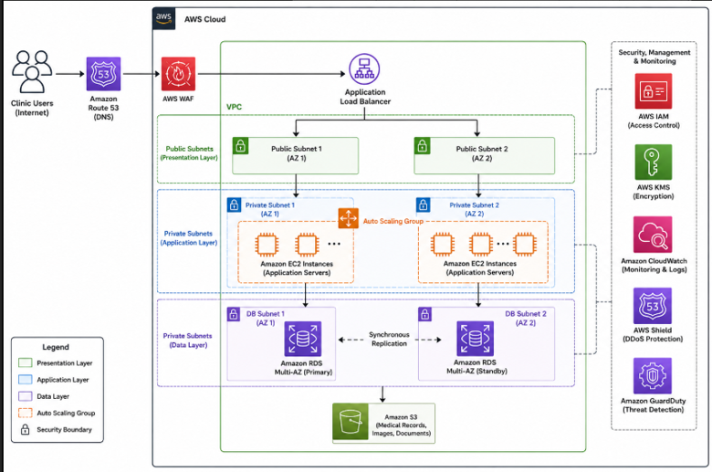

# AWS Cloud Infrastructure Design – MedSys Health Solutions Ltd

## Project Overview

This project presents a proposed AWS-based cloud infrastructure solution for MedSys Health Solutions Ltd, a healthcare organisation supporting more than 40 clinics in the West Midlands.

The project analyses the limitations of the organisation's existing infrastructure and proposes a scalable, secure and highly available AWS-based target architecture.

The proposed solution focuses on improving scalability, system availability, security and operational efficiency while supporting the organisation's future growth.

This project was completed as part of a university Cloud Infrastructure and Design module.

## Existing Infrastructure Challenges

MedSys currently operates a distributed on-premises infrastructure containing virtualised servers, legacy systems, internally managed storage, external backup solutions, web-based services and email systems.

The existing environment has several technical and operational limitations.

These include limited scalability, performance variability during peak usage, fragmented infrastructure, increasing storage and compute requirements, and limited automation.

The organisation also faces reliability and availability concerns because some recovery and maintenance processes are manual and there is limited evidence of automated failover.

As a healthcare organisation, MedSys also needs to protect sensitive patient information and maintain appropriate security and compliance controls.

## Proposed AWS Architecture

The proposed solution uses a layered AWS architecture consisting of a Presentation Layer, Application Layer, Data Layer, and Security and Monitoring Layer.

The architecture is designed to support high availability, scalability, security and controlled access to healthcare systems and data.

The proposed AWS services include:

- Amazon Route 53
- AWS WAF
- Application Load Balancer
- Amazon VPC
- Amazon EC2
- EC2 Auto Scaling
- Amazon RDS
- Amazon S3
- AWS IAM
- AWS KMS
- Amazon CloudWatch
- AWS Shield
- Amazon GuardDuty
  

## Architecture Flow

Users access the MedSys platform through the internet.

Amazon Route 53 provides DNS and directs traffic towards the AWS environment.

AWS WAF is positioned to protect the web application against common web-based attacks such as SQL injection and cross-site scripting.

The Application Load Balancer distributes incoming requests across multiple EC2 application servers.

The infrastructure is deployed within an Amazon VPC to provide network isolation and controlled communication between services.

The VPC is divided into public and private subnets to improve security and workload isolation.

The application layer uses EC2 instances within private subnets.

The EC2 instances are organised within an Auto Scaling group so that computing resources can increase or decrease according to user demand.

The data layer uses Amazon RDS with a Multi-AZ configuration to provide a standby database and support failover.

Amazon S3 is proposed for storing medical records, uploaded documents, archived reports and medical imaging files.

AWS IAM is used to manage authentication and permissions across the AWS environment.

AWS KMS is used to support encryption management for sensitive data stored within AWS services.

Amazon CloudWatch provides monitoring and logging for system health, application performance, resource utilisation and operational alerts.

AWS Shield provides protection against Distributed Denial of Service attacks.

Amazon GuardDuty provides threat detection and monitoring for suspicious activity within the AWS environment.

## Network and Security Design

The proposed infrastructure uses an Amazon VPC with public and private subnets.

Public subnets support public-facing infrastructure components.

Private subnets are used for application workloads to provide additional network isolation.

AWS IAM supports role-based access control so that authorised users can access the required systems and resources.

Encryption is incorporated into the proposed architecture to help protect healthcare information during storage and transmission.

AWS KMS supports encryption key management for sensitive data stored within AWS services.

AWS WAF provides protection against common web application attacks.

AWS Shield provides additional protection against Distributed Denial of Service attacks.

Amazon GuardDuty provides threat detection and suspicious activity monitoring.

Amazon CloudWatch provides centralised monitoring and logging.

## High Availability and Scalability

The proposed architecture uses multiple Availability Zones to improve resilience.

The application layer uses EC2 instances within an Auto Scaling group so that computing capacity can respond to changing demand.

Amazon RDS is configured using a Multi-AZ deployment to provide a synchronised standby database in a separate Availability Zone.

The proposed architecture is therefore designed to improve system availability and reduce the impact of infrastructure failures.

Auto Scaling also helps the organisation manage higher demand during busy clinical operating periods.

## Migration Strategy

A phased migration strategy is proposed to reduce operational disruption during the transition from the existing infrastructure to AWS.

The migration process consists of the following stages:

1. Assessment and Planning
2. Lift-and-Shift Migration to EC2
3. Temporary Hybrid Operation
4. Migration to Managed AWS Services
5. Optimisation and Automation
6. Predominantly AWS Cloud Environment

### Phase 1 – Assessment and Planning

The first phase involves assessing the existing infrastructure, identifying critical systems, mapping dependencies and analysing security and compliance requirements.

### Phase 2 – Lift-and-Shift Migration

Existing virtual servers can be migrated to Amazon EC2 with minimal application modifications.

This provides an initial migration path into AWS while reducing the need for immediate application redevelopment.

### Phase 3 – Temporary Hybrid Operation

The existing on-premises infrastructure and AWS environment can operate together during the transition.

A temporary hybrid environment allows workloads to be moved gradually while systems are tested and validated.

### Phase 4 – Migration to Managed AWS Services

Once systems become stable within AWS, workloads can gradually transition towards managed services such as Amazon RDS and Amazon S3.

### Phase 5 – Optimisation and Automation

Auto Scaling, monitoring and other AWS services can be introduced to improve performance, resilience and operational efficiency.

### Phase 6 – Predominantly AWS Environment

The final stage involves reducing dependence on the existing on-premises environment until AWS becomes the organisation's primary infrastructure platform.

## Why a Hybrid Approach Was Considered

An immediate full cloud migration could introduce operational and technical risks because MedSys currently operates a mixed environment containing legacy systems, virtualised servers and internally hosted services.

A phased hybrid approach allows lower-risk services to be migrated first while existing systems continue operating.

This approach can reduce disruption and allow the organisation to test and validate AWS services before migrating more critical workloads.

The long-term objective described in the proposal is to move towards a predominantly AWS-based public cloud environment once the migration has stabilised.

## Benefits of the Proposed Solution

The proposed AWS infrastructure provides several potential benefits.

These include improved scalability for growing clinical workloads, improved system reliability and availability, improved disaster recovery capabilities, reduced infrastructure management workload and potential cost efficiencies through cloud-based resource usage.

The architecture also provides centralised monitoring, improved security controls and the ability to use managed AWS services.

## Risks and Mitigation

The proposed solution also introduces several risks.

These include cloud dependency and vendor lock-in, configuration and security risks, reliance on internet connectivity, cloud cost management challenges and migration complexity.

The proposal addresses these risks through a phased migration approach, security controls such as IAM, encryption and WAF, monitoring and cost management, staff training, and backup and disaster recovery planning.

## Key Learning Outcomes

This project developed my understanding of AWS cloud infrastructure design and how cloud services can be combined to create a scalable and secure architecture.

The project also developed my understanding of networking concepts including VPCs, public and private subnets, load balancing and Availability Zones.

I gained experience in selecting AWS services based on infrastructure requirements rather than selecting services individually without considering the overall architecture.

The project also developed my understanding of cloud migration strategies, including lift-and-shift migration, hybrid cloud operation, managed AWS services, optimisation and gradual cloud adoption.

Security considerations were also included through IAM, encryption, AWS WAF, AWS Shield, Amazon GuardDuty and monitoring.

## AWS Services and Technologies

- Amazon Web Services (AWS)
- Amazon Route 53
- AWS WAF
- Application Load Balancer
- Amazon VPC
- Amazon EC2
- EC2 Auto Scaling
- Amazon RDS
- Amazon S3
- AWS IAM
- AWS KMS
- Amazon CloudWatch
- AWS Shield
- Amazon GuardDuty

## Project Status

This repository represents an AWS cloud infrastructure design and proposal rather than a complete production deployment.

The AWS environment described in this repository represents the proposed target architecture and should not be interpreted as a production implementation.

The project focuses on cloud architecture design, technical reasoning, AWS service selection, security considerations and migration planning.

## Academic Context

This project was completed as part of a university Cloud Infrastructure and Design module.

The original work was produced as an academic assignment based on the MedSys Health Solutions Ltd case study.

This GitHub repository presents the project as a portfolio case study and summarises the technical design and learning outcomes.
